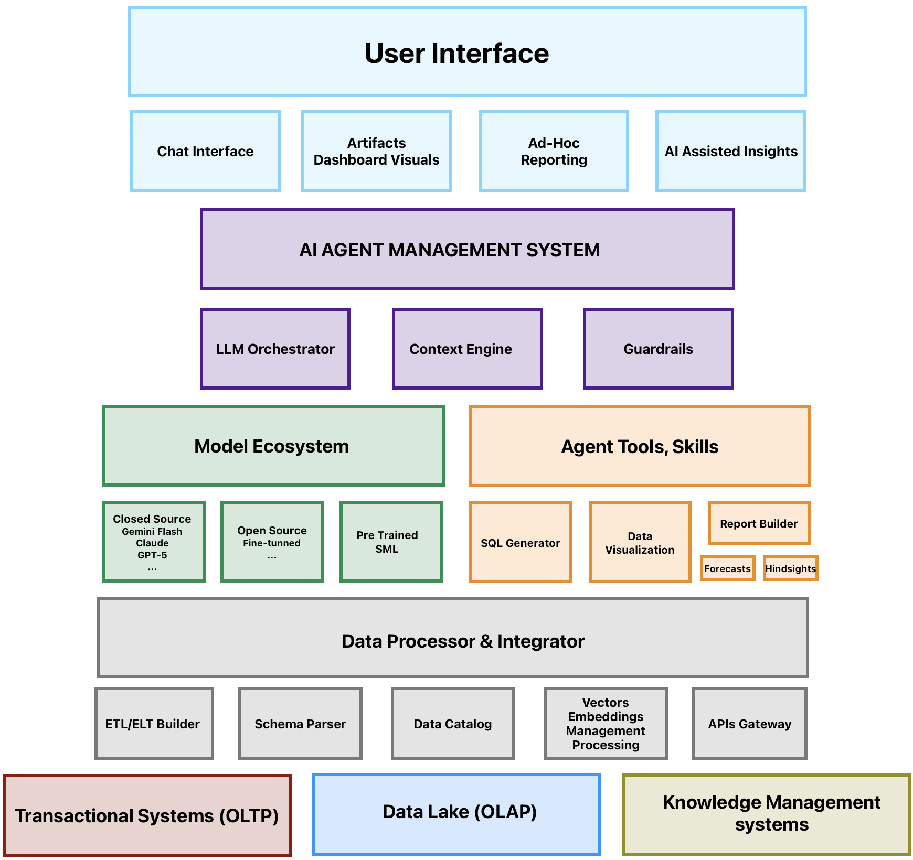

# Enterprise AI Data Intelligence Platform

## System Architecture Overview



## Platform Demo

**Watch the Semantic Data Agent in Action**


*The demo showcases how business users can interact with the AI agent through natural language to query multiple data sources, generate insights, and create visualizations - all through a single conversational interface.*

**Demo Highlights:**

- Natural language querying across multiple data sources
- Real-time data visualization generation
- Multi-source data integration (OLTP, OLAP, Knowledge Base, External APIs)
- AI-powered insights and recommendations
- Seamless user experience from question to actionable insights

## The Unified Enterprise Data Intelligence Solution

### Core Value Proposition

This platform serves as the central nervous system for enterprise data intelligence, where a sophisticated AI agent acts as a universal translator between business users and the complex ecosystem of organizational data sources. The AI agent intelligently combines data from:

- **Transactional Systems (OLTP)** - Live operational data from CRM, ERP, Sales, Inventory, HR
- **Data Warehouse (OLAP)** - Historical analytics, data marts, OLAP cubes for trend analysis
- **Knowledge Management** - Company policies, SharePoint, Confluence, technical docs, training materials
- **External Sources** - Market data, news, social media, regulatory information, competitor intelligence

### AI Agent Intelligence Hub

The Multi-Modal AI Agent acts as the orchestrating intelligence that:

1. **Query Processor** - Understands natural language queries and maps them to appropriate data sources
1. **Context Engine** - Retrieves relevant context from knowledge bases and documents
1. **Response Generator** - Combines structured data with unstructured insights to generate comprehensive answers

### Enterprise Data Flow

```
Business Question → AI Agent → Multi-Source Data Retrieval → Intelligent Analysis → Actionable Insights
```

#### Example Enterprise Scenarios

**Sales Performance Analysis**

- Query: “How did Q4 sales compare to last year, and what external factors influenced the trends?”
- Data Sources: Sales Database (OLTP) + Historical Data (OLAP) + Market Data (External) + Economic Reports (Knowledge Base)
- Output: Comprehensive report with visualizations, trend analysis, and contextual insights

**Compliance & Risk Assessment**

- Query: “Are we compliant with the new regulations, and what’s our exposure?”
- Data Sources: HR Database + Policy Documents + Regulatory Data + Legal Documentation
- Output: Compliance status, risk matrix, and recommended actions

**Strategic Planning**

- Query: “What’s our competitive position and market opportunity?”
- Data Sources: Sales Data + Market Intelligence + Competitor Analysis + Industry Reports
- Output: Strategic recommendations with data-driven insights

### Advanced AI Capabilities

- **SQL Generation** - Converts natural language to optimized SQL queries
- **Data Visualization** - Creates interactive charts and dashboards automatically
- **Natural Language Queries** - Allows business users to ask questions in plain English
- **Predictive Analytics** - Forecasts trends using historical and real-time data
- **Anomaly Detection** - Identifies unusual patterns across data sources
- **Report Automation** - Generates recurring reports with fresh insights

### Technical Architecture

#### Frontend Experience

- **AI Chat Interface** - Natural language interaction with the AI agent
- **Analytics Dashboard** - Real-time visualizations and KPI monitoring
- **Ad-hoc Reports** - On-demand report generation and customization
- **AI Insights** - Proactive insights and recommendations

#### AI Model Ecosystem

- **User Assistant** - Main model communicating with user facilitating user requests and workflow execution
- **Query Rewriter** - Assists with information retrieval from structured unstructured data sources
- **Code Generator** - Generates code (augmented with skills library) - SQL, SPARK SQL, PYTHON for data retrieval & analytics
- **Reviewer** - Review responses, Reinforce desired model actions based on optimized policy

#### Enterprise Integration

- **ETL Pipelines** - Automated data extraction and transformation
- **Data Cleansing** - Ensures data quality across all sources
- **Schema Discovery** - Automatically maps database structures
- **Data Catalog** - Maintains inventory of all data assets
- **API Gateway** - Secure access to all data sources

### Enterprise Security & Governance

- **Read-Only Access** - Ensures data integrity while enabling analysis
- **Role-Based Permissions** - Controls access based on user roles
- **Audit Trails** - Tracks all data access and AI decisions
- **Data Lineage** - Shows the path from raw data to insights
- **Compliance Ready** - Meets enterprise security and privacy requirements

### Business Impact

1. **Accelerated Decision-Making** - From days/weeks to minutes for data insights
1. **Comprehensive Analysis** - Combines multiple data sources for holistic view
1. **Democratized Analytics** - Business users can access complex data without technical expertise
1. **Improved Accuracy** - AI reduces human error in data interpretation
1. **Predictive Capabilities** - Anticipates trends and identifies opportunities
1. **Real-Time Intelligence** - Live data monitoring and instant alerting

### Component Architecture

#### Frontend Layer

- **Chat Interface**: Real-time streaming chat with tool execution display
- **Dashboard**: Data visualization and artifact management

#### Backend Layer

- **API Routes**: Next.js API routes for AI agent endpoints
- **MCP Integration**: Model Context Protocol clients and abstractions
- **Tool Registry**: Centralized tool configuration and schemas
- **Agent Tools**: Enhanced business logic tools

#### Data Layer

- **External APIs**: Firecrawl for web scraping, GitHub for code analysis
- **Databases**: Cloud data warehouse/data lake, Transactional PostgreSQL
- **Vector Store**: Knowledge base (Policy Documents, Project Documents, SharePoint Documents)
- **State Management**: Local storage persistence, real-time chat state

This architecture provides a scalable, performant foundation for enterprise AI applications with extensive data analysis and visualization capabilities.​​​​​​​​​​​​​​​​
